# Predicting Dow Jones Industrial Average Ups and Downs with Daily Top News Headlines
MSDS-696 - Data Science Practicum II - Final Project Report  
[Video Presentation](https://youtu.be/B9-KUZNqPQE)

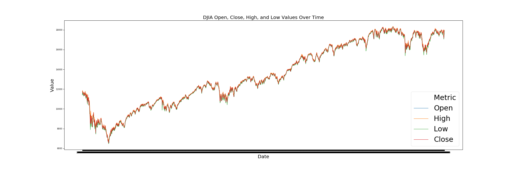
## Introduction
In this project, I have attempted to create a stock market performance prediction model using news headlines to assist with better investment performance. News reports can have a profound impact on stock market performance (Beers, 2019), but the problem is that there are so many news articles published every day that it’s nearly impossible for an individual person to be aware of everything going on in the news at any given moment, much less quantify the impact of each article on stock market performance. This project aims to address this issue by using natural language processing (NLP) and clustering on historic news headlines and stock performance from each day to better understand how the news can impact the stock market and, more importantly, assess how these news headlines can be used to predict whether the stock market will rise or fall that day and/or in the near future.

## The Data
For this project, I used Kaggle datasets that include the top 25 daily news headlines from June 8, 2008 to July 1, 2016 and Dow Jones Industrial Average (DJIA) stock performance data during this same time period (Aaron7sun, 2016). This dataset contains nearly 2000 rows and 33 columns overall and is easily downloadable from Kaggle.

## Dependencies
Packages and libraries I made use of throughout this project include:
- `pandas`
- `numpy`
- `re`
- `seaborn`
- `matplotlib`
- `NLTK`
- `sklearn`
- `string`
- `statsmodels`
- `pylab`
- `operator`
- `wordcloud`
- `textblob`
- `datetime`
- `tqdm`
- `keras`

## Data Cleaning
For the data used in this model, the DJIA stock data was already very clean and did not contain any null values or anything similar that would require cleaning. The headlines data, however, did require some cleaning. Some of the headlines at some point had been saved as bitstrings, which resulted in these headlines beginning with `b'` and ending with `'`, so I addressed this with a simple regex match, replacing these artifacts with empty strings:
```
# compile regex since will be applying to multiple columns
bitstr_artifacts = re.compile(r"""^b'|^b"|"$|'$""")
# replace all instances of bitstring artifacts from headline columns in combined dataframe
for col in list(combined_df.columns)[2:]:
    combined_df[col] = combined_df[col].str.replace(bitstr_artifacts, '')
headlines_df['News'] = headlines_df['News'].str.replace(bitstr_artifacts, '')
```
Other notable cleaning steps for the headlines data included removing punctuation, replacing URL encoded values (such as `amp&`) with their semantic word equivalents, and also tokenizing the words from each headline:
```
for col in list(combined_df.columns)[2:]:
    # convert columns to str b/c Top23 apparently has byte like object
    combined_df[col] = combined_df[col].astype(str)
    # saw instance of & in S&P encoded as &amp; in last row of combined_df.tail(), replace with and to maintain semantic
    combined_df[col] = combined_df[col].str.replace("&amp;", "and")
    # replace hyphens with blank space. Don't want to combine hyphenations into single word as more meaninful as separate words
    combined_df[col] = combined_df[col].str.replace("-", " ")
    # replace all punctuation with blank space
    combined_df[col] = combined_df[col].str.replace(rf'[{string.punctuation}]', "")
    combined_df[col + '_tokenized'] = combined_df[col].apply(word_tokenize)
```
Finally, in order to make this headline data more useful for NLP and clustering, I had to remove all stop words from the headlines and convert them all to lowercase. Something that I decided to do here to make it a bit more interesting was investigate the effects of not perfomring these steps by looking at word frequency distributions before, during, and after cleaning the headlines. 

The first plot here is before I removed stop words and converted to lowercase. In this plot, stop words clearly win out as the most common words in all of the headlines making up all of the top 10 most frequent words and composing more than half of the top 50 most frequent words. Additionally, notice how both `a` and `A` are present since this is a case sensitive task:
```
all_headlines = " ".join(headlines_df['News'])
fdist = FreqDist(all_headlines.split())
plt.figure(figsize=(10, 5))
plt.title("Word Frequency Plot Pre-Cleaning")
fdist.plot(50, cumulative=True)
```
  

In this next plot I simply removed stop words and then remade the word frequency plot. Notice here that there are still some stop words since the method I used from the NLTK package to remove stop words expects all lowercase words, and despite removing all lower case stop words a stop word (`The`) is _still_ the most frequent word in the corpus of headlines:
```
en_stops = set(stopwords.words('english'))
all_headlines_no_stopwords = ""
for word in all_headlines.split():
    if word not in en_stops:
        all_headlines_no_stopwords += word + " "
fdist2 = FreqDist(all_headlines_no_stopwords.split())
plt.figure(figsize=(10, 5))
plt.title("Word Frequency Plot Mid-Cleaning")
fdist2.plot(50, cumulative=True)
```


Now in the last plot below I converted everything to lowercase and then removed all stop words. In this case all stop words were taken care of and I am now able to get a good idea of what the most frequent, meaningful, words are from the headlines, among the top 5 are `us`, `says`, `new`, `police`, and `government` which indicates to me that oftentimes headlines are telling us something about the United States, what someone or something said, about new things, and about institutions like police and government:
```
all_headlines_lower = all_headlines.lower()
all_headlines_lower_no_stopwords = ""
for word in all_headlines_lower.split():
    if word not in en_stops:
        all_headlines_lower_no_stopwords += word + " "
fdist3 = FreqDist(all_headlines_lower_no_stopwords.split())
plt.figure(figsize=(10, 5))
plt.title("Word Frequency Plot Post-Cleaning")
fdist3.plot(50, cumulative=True)
```


And with that I was satisfied with my data cleaning, wrote the cleaned data out to CSVs, and moved on to EDA.

## Exploratory Data Analysis (EDA)
#### DJIA Data Exploration
The first thing I wanted to do in terms of exploring the data was related to the timeseries nature of stock market data. I wanted to see what this data looks like decomposed into the various components that are present in the data. To do this, I isolated the date and stock closing prices from the DJIA dataset, then applied the `seasonal_decompose` function to this. For the type of decompositional model, I decided to go with a multiplicative model because when it comes to stocks we care much more about the percentage difference from one time period to the next than we care about the absolute difference between these two numbers:
```
# grab just Date and closing value columns
temp = DJIA[['Date', 'Close']]
# need to set the date as the index for the seasonal_decompose function to work properly
temp = temp.set_index('Date')
# apply seasonal_decomposition function
decomp = sm.tsa.seasonal_decompose(temp, model='multiplicative', freq=365)
decomp.plot()
```


Clearly the general trend is that the stock market has been steadily rising over the 8 year period of this data, but what's really interesting to me is the seasonal aspect of this decomposistion. Looking at the seasonal trend, it appears that, typically, the stock market rises at the beginning of the year, takes a tumble in the middle of the year, then rises again, before finally taking one last tumble at the end of the year. This isn't strictly true for every year here, but for the most part the pattern holds, which is very useful to know in and of itself and might help to explain some of the recent turmoil in the economy; perhaps it's all just part of the pattern.

Next, I decided it would be interesting to engineer a `net_change` feature for the stocks dataset and explore this as well as see how this relates to the other variables in the dataset. I began by looking into the distribution of this new feature: 
```
DJIA['net_change'] = DJIA['Close'] - DJIA['Open']
DJIA.boxplot(column='net_change')
plt.title("DJIA Value Net Change Boxplot")
```
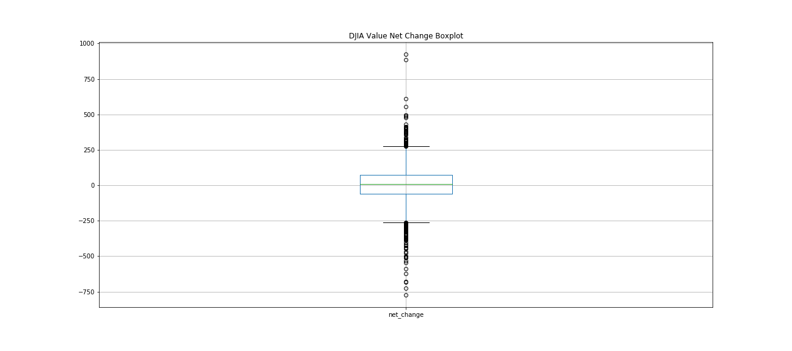

In this plot, I was interested to see that the wiskers are right around the 250 and -250 marks, which told me that while a net change of a couple hundred is a relatively rare and significant event being near the end of the wiskers, this isn't an outlier, which was interesting to me considering that 50% of net changes are between -60 and 75.

Next, I looked into how `net_change` might relate to other variables in the dataset as well as how these other variables relate to eachother using a scatter matrix:
```
pd.plotting.scatter_matrix(DJIA, figsize = (15, 15))
```
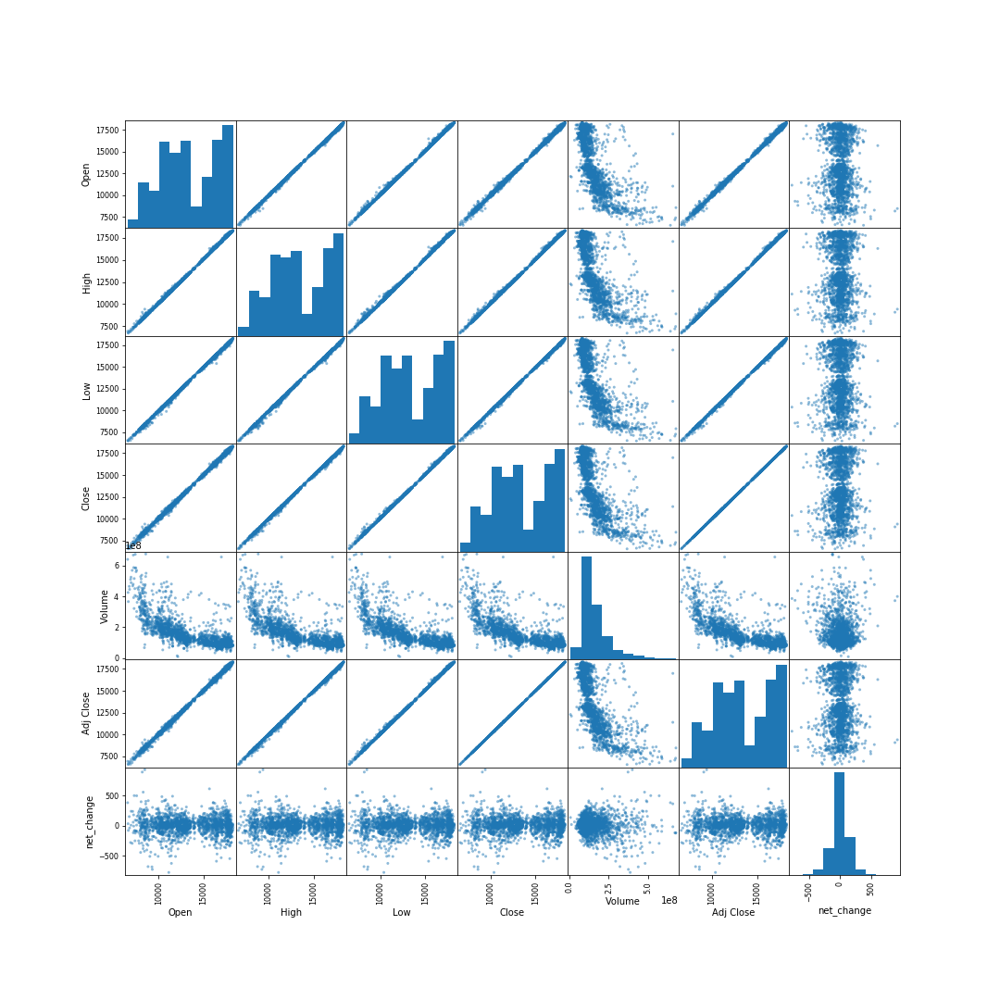

Unfortunately this didn't really add many insights as the near perfect correlations between all metrics other than Volume are practically perfectly straight lines. What this does show, however, is that a very high volume of trades occur on days when stocks have a low value and the amount of trading decreases as the value of the stock increases. This makes sense to me because of the age old addage to "Buy Low Sell High". This tells me one of two things: either people are really good at taking the buy low advice, but not quite so much with the sell high advice, or since people are so disinclined to buy high it doesn't really work out to sell high because no one is there to buy. In all actuality, I imagine these two things have a combinatorial impact on what we see here. Another interesting thing I saw with the volume data is that the correlation plots show a variable variance within them where the varaince of trade volume is much wider on days where stock values are lower while the variance window tightens as stock prices go up. This tells me that people are much less certain about what to do with their stocks when stock value is low whereas people seem to be more in sync when stock values are high. This suggests to me that people are fairly confident when the stock market is doing well that it will continue to do well but a large amount of uncertainty is introduced when the market begins doing poorly.

Another interesting things that this scatter matrix told me is more in relation to the distribution of the columns (seen in the histograms where column match with themselves) than the correlations themselves. All metrics aside from Volume have a very clear bimodal distribution along with a left skew while the Volume column has a unimodal distribution but a clear right skew. I'm not sure what this really means, but it's interesting to note.

As for the `net_change` column, the only thing I noticed here is that the variance of the net change widens as the trading volume goes up, which makes sense as trades are really what drive stock price changes. Additionally, the distribution of the net change is actually surprisingly normal to the naked eye. 

#### Headlines Data Exploration
During data cleaning, I did some preliminary EDA of the headlines by looking at the word frequency distributions of all the headlines overall, but something that I thought would be interesting is to isolate the `Top#` columns from the combined dataset and see if there are any noticable differences between the word frequency distributions of these various top headlines. To do this, I created a `ConditionalFreqDist` where I set the `Top#` as the condition in order to get frequency distributions by `Top#` headline:
```
# create empty conditional frequency distribution
cfdist = ConditionalFreqDist()
# loop through columbs of combined dataset
for col in list(combined.columns):
    # only want to work with cleaned columns
    if col.endswith("_cleaned"):
        # set the condition to the Top#
        condition = col.split("_")[0]
        # loop through each entry in the current column
        for item in combined[col]:
            # one item ended up empty after removing all digits and stop words, so skip this
            if str(item) == 'nan':
                continue
            # tokenize words in current item and loop through these
            for word in word_tokenize(item):
                # create word counds by condition in conditional frequency distribution
                cfdist[condition][word] += 1
```
Since I wanted to compare the frequency distributions of each `Top#` headlines, but I only really cared about the top words in each of these frequency distributions, I isolated the top 10 words from each of the frequency distributions and placed them into a set which will contain only the top 10 words from each column:
```
# initialize set
top_words = set()
# loop through the conditions
for key in list(cfdist.keys()):
    # initialize counter
    count = 0
    # since dictionarys are not sorted, sort them into list of tuples by value descending to ensure getting top counts
    cur_sorted = sorted(cfdist[key].items(), key = operator.itemgetter(1), reverse = True)
    # loop through the sorted list
    for item in cur_sorted:
        # add word to top words
        top_words.add(item[0])
        # increment counter
        count += 1
        # if reached count of 10 for current column break to next column
        if count == 10:
            break
```
With this in place, I then created conditional frequency distribution plots, isolating 5 `Top#` columns at a time in order to actually see distinctions between the columns:

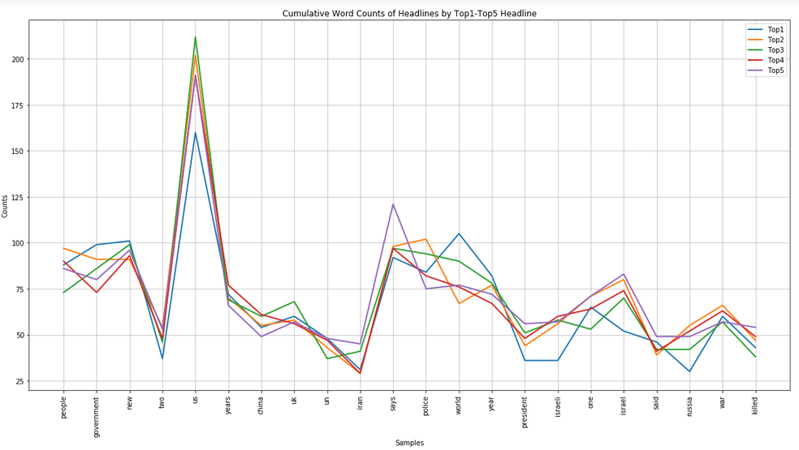

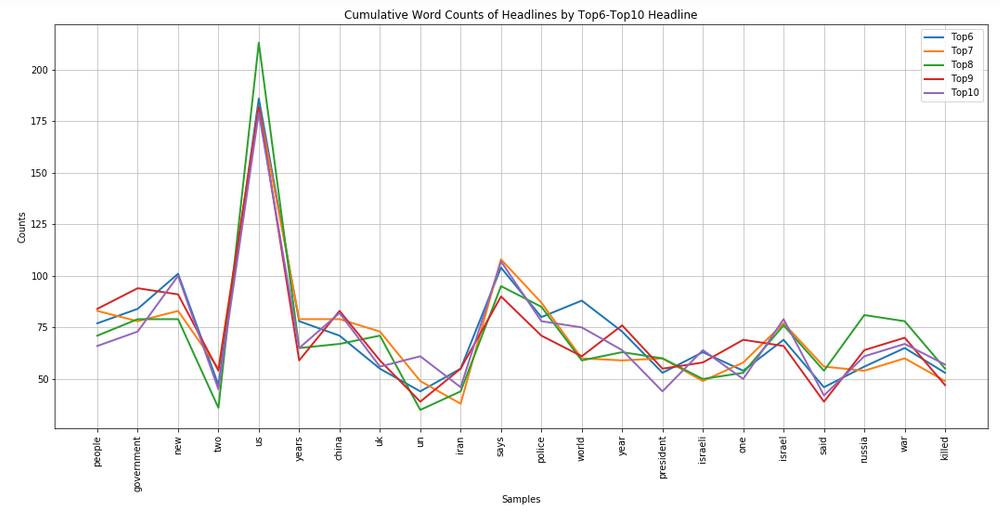

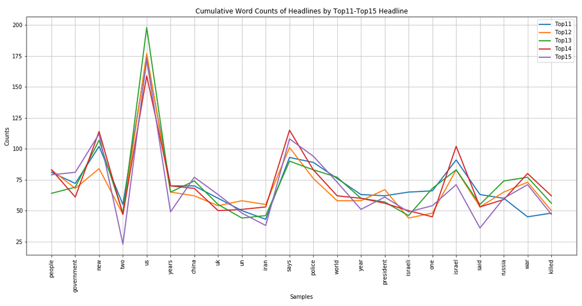

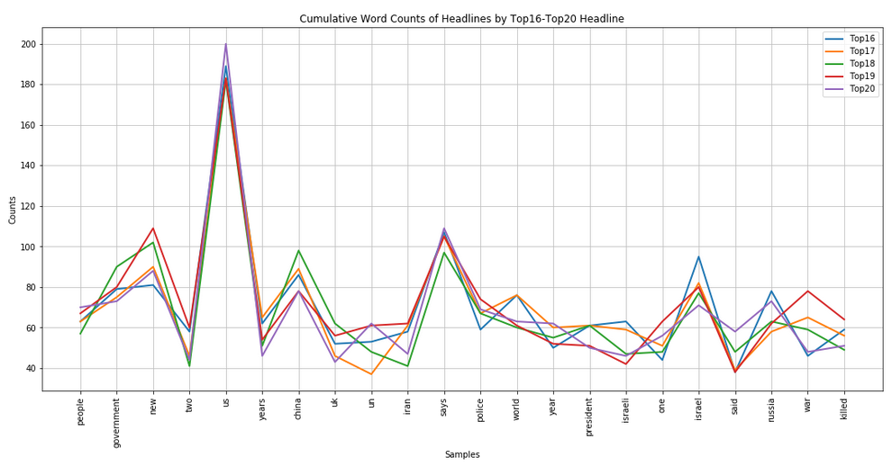

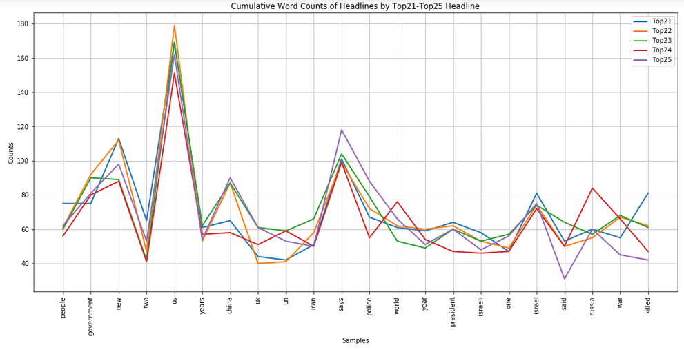

From these plots, it appears that the `Top1` column shows an increased mention of `world` while this same column is showing a lower occurance rate of `russia` and `isreali` compared with other columns which, to me, indicates that oftentimes the most popular headlines relate more to global issues rather than individual country issues. Aside from this there weren't any differences that are worth noting.

After that I wanted to create some more interesting and visually appealing visualizations, so I decided to create a word cloud using all of the headlines to get a visual representation of what top headlines overall typically talk about:
```
# initialize temporary string
temp = ""
# loop through each headlines in the cleaned headlines
for line in headlines['News_cleaned']:
    # one headline ended up empty after removal of stop words and numbers, so just skip this
    if str(line) == "nan":
        continue
    # append lines to temporary string
    temp += line + " "
# generate word cloud with a max of 100 words using the temporary string
wc = WordCloud(max_words = 100, background_color = 'white').generate(temp)
plt.imshow(wc)
plt.axis('off')
plt.show()
```
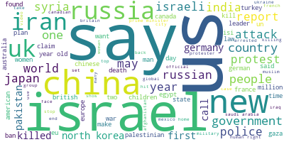

Clearly many of the top words I mentioned when looking at word frequencies during cleaning are obvious here (US, say, new, police, and government). Something that I found odd, though, is the fact that government and police are actually smaller than other words like China, Israel, Russia, and Iran. I’m not too sure why this is, as I would’ve expected to see the top words from my initial word frequency distributions as the largest words here. 

At this point I was anxious to get on with building my models, so I moved on to the next phase of my project.

## Model Building
Now that I had collected, cleaned, and explored my data, it was time to start with the real meat and potatos of this project: building out my models. Overall, I build out 3 models. The first one is a sentiment analysis model in which I assigned a sentiment score to each of the headlines in the combined dataset as well as used all the headlines in each day to assign an overall sentiment score for that day. The second model I built was a clustering model in which I clustered the headlines in order to generally categorize the headlines using the clusters that the model came up with. Finally, I will built out the model we've all been waiting for: the stock market prediction model for trying to predict whether markets will close up or down based on headlines.

#### Sentiment Analysis
The first thing I wanted to do was some sentiment analysis. The `textblob` package made this extremely easy where I just had to convert the text I wanted to analyze to a `TextBlob` object and then I was able to obtain information about the sentiment of that blob using using the `polarity` (i.e. a score of positive or negative) and `subjectivity` (i.e. a score representing how subjective a statement is) properties:
```
# create empty lists to hold polarity and subjectivity scores
polarity = list()
subjectivity = list()

# loop through each headlines in the news dataset. Sticking with non-cleaned column because TextBlob is very flexible
for headline in tqdm_notebook(headlines['News'], desc = "Headlines Processed:"):
    # convert headline to TextBlob object
    blob = TextBlob(headline)
    # Append polarity and subjectivity scores to respective lists
    polarity.append(blob.polarity)
    subjectivity.append(blob.subjectivity)
    
# create polarity and subjectivity columns
headlines['polarity'] = polarity
headlines['subjectivity'] = subjectivity

headlines.head()
```
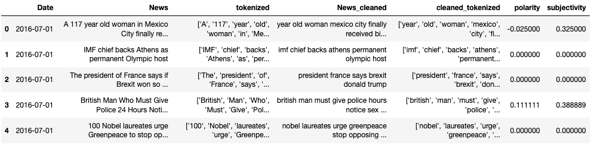

Initially, I was a bit concerned that I was going to end up with unusable scores accross the board for the headlines since they are composed of so many nouns and things that don't necessarily have a polarity or subjectivity associated with them. There are still a number that have scores of 0, but still a few more informative scores which is good. The above is from when I performed this on the headlines dataset itself, I subsequently performed this same process on the combined dataset, which can be seen in the [model building notebook](Predicting%20Stock%20Performance%20with%20Top%20News%20Headlines%20-%20Model%20Building.ipynb).

Since I wasn't sure how much individual polarity and subjectivity scores for each of the top 25 headlines from a day would impact the final model, I also obtained overall polarity and subjectivity scores for the headlines from each day as I felt this may be more useful for final predictions. To do this, I converted all the headlines from each day into a single text blob and analyze the sentiment on that:
```
# Initialize empty lists
polarity = list()
subjectivity = list()
# loop through every row in the dataset
for i in tqdm_notebook(range(combined.shape[0]), desc = "Combined Dataset Rows Processed:"):
    # grab Top1-Top25 headlines, cast to list, and join each element of that list with a space to get single 
    # textblob object for all top headlines for the day
    blob = TextBlob(" ".join(list(combined.iloc[i, 2:27])))
    # Append polarity and subjectivity scores to lists
    polarity.append(blob.polarity)
    subjectivity.append(blob.subjectivity)

print("DONE!")
combined['overall_polarity'] = polarity
combined['overall_subjectivity'] = subjectivity

combined[['overall_polarity', 'overall_subjectivity']].head()
```
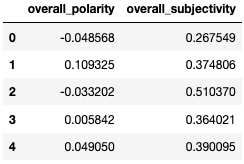

Now I had overall polarity and subjectivity score for each day, I was interested to see the distributions of these overall sentiment scores for each day:

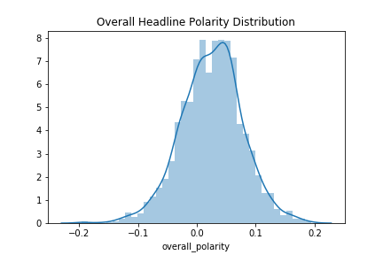


For the most part, headlines generally skew positive on a day to day basis, this is something I wouldn't have expected due to the generally bad reputation the news gets for focusing on the negative! Of course this polarity plot is fairly narrow, only spanning a range of -0.2 to 0.2, indicating to me that, for the most part, headlines don't have much of a positive or negative bias when you look at the big picture. As for subjectivity, it looks like news headlines are, on average, mildly subjective when you look at the big picture, though I'm happy to see that the vast majority of this plot stays below the 0.5 mark indicating to me that, for the most part, headlines focus more on fact than opinion, which I personally believe should be the case.

With that I was done with the sentiment analysis aspect and it was time to move on to the clustering aspect of the model.

#### Clustering Model
For my clustering model, I clustered the headlines to get an idea about general categories that the headlines fit into. In order to do this effectively, I first needed to do a couple of things, first of which was convert my text data to numeric data as this is what the k-means clustering algorithm requires. I did this using the `TfidfVectorizer` function, which stands for a Term Frequency - Inverse Document Frequency Vectorizer, which in this case essentially assigned numeric values to the words in each headline based on the frequency of the words both within headlines (higher score) and accross documents (lower score): 
```
# https://pythonprogramminglanguage.com/kmeans-text-clustering/
vectorizer = TfidfVectorizer(stop_words='english')
headlines_vect = vectorizer.fit_transform(headlines['News_cleaned'].astype(str))
```
Now that the vector was in place the next thing I needed to accomplish before creating my final clustering model was determine the number of clusters to use. There are a few ways to accomplish this, two of which are the Elbow method and the Silhouette method. I tried both and found that the Silhouette method was much to slow to be practical, so I stuck with the Elbow method. In the Elbow method, I ran the k-means algorithm with my data for a range of number of clusters to see at which point increasing clusters doesn't do much for decreasing the sum of squares distances, which I determined using a plot where I looked for the "elbow" indicating that sum of squares distance was decreasing more slowly with increased clusters:
```
# This takes a bit, so getting the start time to track execution times
start = datetime.now()
# create list for storing sum of squares distances
ssq_dists = list()
# create range of number of clusters to attempt, here 1 through 20
ks = range(1,21)
# set last run to start time to facilitate tracking length of exection
lastrun = start
# create runtimes dict for keeping track of run times by number of clusters
runtimes = dict()
# for each number of clusters to attempt
for k in ks:
    print("Attempting with " + str(k) + " clusters...")
    # run k-means with number of clusters, specifying random state for reproducibility
    km = KMeans(n_clusters=k, random_state=101)
    # Fit the data to the clusterming model created
    km = km.fit(headlines_vect)
    # get current time
    cur = datetime.now()
    # get total elapsed time so far
    elapsed = cur - start
    # get length of current run
    cur_run = cur - lastrun
    # add current run runtime to runtimes dict at key of current cluster count
    runtimes[k] = cur_run
    # set last run end time to current time
    lastrun = datetime.now()
    # print to track progress of loop
    print(str(k) + " clusters done in " + str(cur_run.seconds) + " seconds, or " + str(cur_run.seconds / 60) 
          + " minutes. \nTotal elapsed time " + str(elapsed.seconds / 60) + " minutes.")
    # add sum of squares distance for current model to sum of squares list for plotting after loop
    ssq_dists.append(km.inertia_)

# calculate total runtime of above loop
total_time = datetime.now() - start
# notify that loop is done
print("Done! Execution took " + str(total_time) + ". Building elbow plot...")
# generate and display plot of sum of square distances by number of clusters
plt.plot(ks, ssq_dists, 'bx-')
plt.xlabel('k')
plt.ylabel('Sum_of_squared_distances')
plt.title('Elbow Method For Optimal k')
plt.savefig("visualizations/lineplots/elbow_method_plot.png")
plt.show()
```
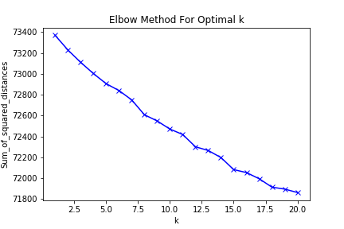

Unfortunately there wasn't as obvious an elbow in the plot as I would've liked to see. Even so, there were a couple points where the slope clearly changed. The first of these seem to occur at 5 and 8 clusters, and while I’m used to picking the lower number of clusters, I couldn’t help but notice that the slope from 7 to 8 clusters is quite steep while the slope seems to be more consistently smaller after 8 clusters, so I stuck with 8 clusters for my final clustering model.

With the clusters created, I wanted to see if the clusters really did have some sort of categorical meaning behind them. To determine this, I created Word Clouds by cluster and see if I could recognize some patterns regarding cluster category. Below my code snippet are the resulting clusters and brief desctriptions of the categories I determined about each:
```
def gen_wordcloud(col, count):
    # initialize temporary string
    temp = ""
    # loop through each headline in the column
    for line in col:
        if str(line) == "nan":
            continue
        # append lines to temporary string
        temp += line + " "
    # generate word cloud with a max of 100 words using the temporary string
    wc = WordCloud(max_words = 100, background_color = "white", repeat = False, collocations = False).generate(temp)
    # write out to file for vizualizations folder
    wc.to_file('visualizations/wordclouds/cluster{0}_wordcloud.png'.format(str(count)))
    plt.figure(figsize = (20, 10))
    plt.imshow(wc)
    plt.axis('off')
    plt.title('Word Cloud for Cluster ' + str(i), fontdict = {
        'fontsize': 20,
        'fontweight' : 5,
        'verticalalignment': 'baseline',
        'horizontalalignment': 'center'
    })
    plt.show()

for i in sorted(headlines['cluster'].unique()):
    gen_wordcloud(headlines[headlines['cluster'] == i]['News_cleaned'], i)
```


In cluster 0, clearly China and Chinese are mentioned a lot and so are some other countries in this region of the world, like Russia, India, and Japan while the US is also thrown in there. This tells me that cluster 0 is primarily related to China and it's relationships in the world.


In cluster 1, Iraq and Afghanistan are mentioned the most along with words like war, US, Talian, Syria, soldier, and military. This tells me that cluster 1 is primarily related to war in the middle east


As for cluster 2, the most common words are killed and Pakistan while there is also mention of other words like civilian, Taliban, strike, death, and people. To me, this is somewhat also related to conflict in the middle east like cluster 1 but more so related to death and injury rather than war itself


Cluster 3 is clearly contains Korea more than any other word with North and South following near behind along with other words like Korean, Kim, Jong, Un, and Nuclear among others. Clearly this cluster primarily refers to the Koreas and the tension and conflict going on in that region.

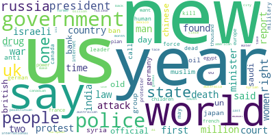

Now looking at cluster 4 I really don't see that much of a clear pattern amongst the words and many of the ones present here remind me of the common words in the overall corpus of headlines. This tells me that this is likely the miscellaneous cluster where things that didn't fit well into other clusters wound up.

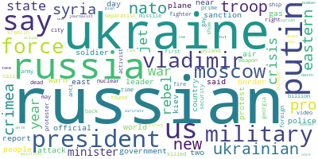

For cluster 5 the most common word is Russian followed by words like Ukraine, Vladimir, Putin, Russia, and Moscow, clearly indicating to me that this cluster primarily holds headlines related to Russia, especially in regards to the Russia-Ukraine conflict


The most common word in cluster 6 is obviously Isreal followed by words like Gaza, Palestinian, Isreali, settlement, state, and Hamas, which indicates to me that this cluster contains headlines primarily focused on the Palistinian-Isreali conflict over the Gaza strip


Finally, cluster 7 has Iran as the most common word followed by Nuclear, US, attack, sanction, deal, and Isreal. This indicates to me that this cluster contains primarily headlines that pertain to the Iranian Nuclear Deal and Iran in general.

With that my supporting models were complete and I was ready to move on to the final stock prediction model

#### Model Predicting DJIA Rise and Fall with Headline Sentiment and Clusters
Now the moment we've all been waiting for: it is time to discuss my final models in which I tried to predict whether stocks will rise or fall on a day based on details relating to the top 25 news headlines from that day. I say models here because I tried a few different approaches. Since market rise vs fall is a binary variable, I primarliy used binary prediction techniques, and the two algorithms I focused on the most were logistic regression and random forest, but later on I also tried using a Neural Network. Unfortunately I wasn't able to generate any models that were much better than chance at predicting stock rise vs fall, so I won't dig too much into the details of what I attempted but I will discuss the most successful models of each approach. I will start with discussing the logistic regression approach.

For the logistic regression model, the best accuracy I was able to obtain was only 51%, and in order to get this far I had to isolate the important columns from the combined dataset since there were a number of columns that didn't relate to the predictor variables I wanted to use (i.e. polarity, subjectivity, and cluster columns for predictors and  the label column for the outcome variable), split this data into training and testing sets, perform Recursive Feature Elimination to scope my predictor variables down to only those that were most valuable to the model, and finally train and test the Logistic Regression model:

First I isolated the predictor and outcome columns and split this into training and testing sets:
```
# get all columns that aren't the Label column for x
x = data[[c for c in list(data.columns) if c != "Label"]]
# Split data into training and testing sets using a 70/30 split
x_train, x_test, y_train, y_test = train_test_split(x, data['Label'], test_size = 0.3, random_state = 101)
```
Then, I performed recursive feature elimination to scope down my initial 77 predictors to just 20:
```
# initialize new logistic regression model
lr = LogisticRegression()
# Perform recursive feature elimination to get 20 of the original features
rfe = RFE(lr, 20)
# fit the RFE model to the training data
rfe = rfe.fit(x_train, y_train.values.ravel())
# initialize list to hold columns to keep
keep_cols2 = list()
# populate keep_cols with those that the recursive feature elimination stated to keep
for i in range(len(rfe.support_)):
    if rfe.support_[i]:
        keep_cols2.append(list(x_train.columns)[i])
```
Then, I recreated my training and testing sets using this scoped down set of predictors:
```
# append Label column to keep_cols so don't lose the label column when subsetting
keep_cols2.append('Label')
# create new dataset of just the columns to keep
data3 = data[keep_cols2]
# grab predictor columns from new dataset
x3 = data3[[c for c in list(data3.columns) if c != "Label"]]
# split new dataset into training and testing sets usint 70/30 split
x3_train, x3_test, y3_train, y3_test = train_test_split(x3, data3['Label'], test_size = 0.3, random_state = 101)
```
And finally I trained and evaluated this model:
```
# initialize new LR model
lr = LogisticRegression()
# fit model on new training set
lr.fit(x3_train, y3_train)
# predict labels for testing set
y3_pred = lr.predict(x3_test)
# output accuracy
print('Accuracy of logistic regression classifier on test set: {:.2f}'.format(lr.score(x3_test, y3_test)))
# Create and print confusion matrix
cm = confusion_matrix(y3_test, y3_pred)
print("Confusion Matrix")
print(cm)
```
Accuracy of logistic regression classifier on test set: 0.51  

Confusion Matrix

| Actual    | Down | Up  |
|-----------|------|-----|
| Predicted |      |     |
| Down      | 96   | 171 |
| Up        | 119  | 211 |

Clearly this model didn't do so great, misclassifying nearly twice as many Up days as Down days while showing the opposite pattern for Up days. This indicates to me that really the model is biased toward Up days, and perhaps this is why it has an increased accuracy: because there are ever so slightly more up days than there are down days, hence the general upward trend of the stock market.

Next, I tried building out Random Forest Classifier Models. The best score I was able to get with the Random Forest Classifier model was a mean AUC score of just over 0.53, which isn't really much of an improvement over the LR model, though it is ever-so-slightly better. To get this score, I had to do a number of things. First off, like above, I had to use the same scoped down set of predictors, but on top of that I optimized the model hyperparameters using a Randomized Search with Cross Validation on a range of potential hyperparameters:
```
# number of trees in random forest, using 10 values from a range of 200 to 2000
n_estimators = [int(x) for x in np.linspace(start = 200, stop = 2000, num = 10)]

# number of features at every split, options include auto, sqrt (same as auto), log2, None and numeric values
max_features = ['auto', 'log2', None]

# minimum number of samples before node split
min_samples_split = [2, 5, 10]

# minimum number of samples required at each leaf node
min_samples_leaf = [1, 2, 4]

# Method of selecting samples for training each tree, False uses all samples for each tree
bootstrap = [True, False]

# max depth of the tree, using 11 values with range of 100 to 500 
max_depth = [int(x) for x in np.linspace(100, 500, num = 11)]
max_depth.append(None)

# create random grid of hyperparameters to pass into RandomizedSearchCV
random_grid = {
    'n_estimators': n_estimators,
    'max_features': max_features,
    'min_samples_split': min_samples_split,
    'min_samples_leaf': min_samples_leaf,
    'bootstrap': bootstrap,
    'max_depth': max_depth
}
# Random search of parameters using RandomForestClassifier as estimator, 200 iterations, with 5 folds in the
# cross validation. Setting random state for reproducibility and n_jobs to -1 for parallelization
rfc_random = RandomizedSearchCV(estimator = rfc, param_distributions = random_grid, n_iter = 200, cv = 5, 
                                verbose = 2, random_state = 101, n_jobs = -1)
# Fit the model on the training data
rfc_random.fit(x_train, y_train)
# print results of the best parameters determined by the algorithm
print("\n\nBest parameters determined by Randomized Search Cross Validator: " + str(rfc_random.best_params_))
```
From running this, I found that the optimum hyper parameters were as follows:
* n_estimators = 1800 
* min_samples_split = 2 
* min_samples_leaf = 4 
* max_features = 'auto' 
* max_depth = 420 
* bootstrap = True

Training and evaluating the Random Forest Classifier model using the scoped down predictors set as well as the optimized hyperparameters as followed gave me my best accuracy thus far:
```
# initialize new RandomForestClassifier model specifying optimal hyperparameters from above output
rfc3 = RandomForestClassifier(n_estimators = 1800, min_samples_split = 2, min_samples_leaf = 4, max_features = 'auto', 
                             max_depth = 420, bootstrap = True, random_state = 101)
# fit the model to the training data
rfc3.fit(x3_train, y3_train)
# generate label predictions from testing set
rfc3_predictions = rfc3.predict(x3_test)
# cross validate the model using 10 folds and ROC AUC algorithm for scoring
rfc3_cv_score = cross_val_score(rfc3, x3, data3['Label'], cv=10, scoring='roc_auc')

# output performance metrics
print("Confusion Matrix")
print(confusion_matrix(y3_test, rfc3_predictions))
print("\nClassification Report")
print(classification_report(y3_test, rfc3_predictions))
print("\nAll AUC Scores")
print(rfc3_cv_score)
print("\nMean AUC Score")
print(rfc3_cv_score.mean())
```
Confusion Matrix

| Actual    | Down | Up  |
|-----------|------|-----|
| Predicted |      |     |
| Down      | 92   | 175 |
| Up        | 123  | 207 |

Classification Report

|             | precision | recall | f1-score | support |
|-------------|-----------|--------|----------|---------|
| 0           | 0.43      | 0.34   | 0.38     | 267     |
| 1           | 0.54      | 0.63   | 0.58     | 330     |
| avg / total | 0.49      | 0.50   | 0.49     | 597     |


All AUC Scores  
\[0.52115365 0.50155763 0.53029846 0.57230429 0.54632263 0.45970057 0.50922888 0.55588597 0.58336751 0.54522149\]

Mean AUC Score  
0.5325041101726599

Clearly this model didn't do great, but it did sightly better than the LR model. From the classification report, it is quite clear that this model is better at predicting Up days than Down days as indicated by the higher `precision` and `recall` scores for Up days. Even still, these scores aren't very great. 

As a sort of last-ditch effort, I decided to try out a Neural Network to see if this might perform better than both the Logistic Regression and Random Forest models. I felt that it might because NNs are known for doing much better with a multitude of predictor variables compared with other models like Logistic Regression, so I figured I'd give it a try. As it turned out, the NN model did do better than both of the other models, but only by a bit, producing accuracy scores of just over 55% on the testing set, which is still a fairly poor performance. In my NNs, I created 5 hidden layers each with exponentially decreasing numbers of nodes. Surprisingly this didn't take much tweaking to get the slightly improved accuracy over the LR and RF models as all I really did was play around with the activation functions at each layer. In the end, I found that both `relu` and `elu` activation functions performed equally well on this data. Below is my implementation of the NN with the `relu` activation and the subsequent loss and accuracy scores:
```
# grab just label, polarity, subjectivity, and cluster columns 
temp = [x for x in list(combined.columns) if x == "Label" or x.endswith('ity') or (x.startswith('Top') and x.endswith('cluster'))]
# subset the combined dataset to grab just the key columns
data = combined[temp]
# set label column as y or outcome column
y = data['Label']
# set all columns aside from Label as x or predictor columns
x = data.drop('Label', axis = 1)
# generate 80/20 train test split, going with 80/20 because NN's do better with more input data
x_train, x_test, y_train, y_test = train_test_split(x, y, test_size = 0.2, random_state = 101)

# create a sequential classifier
classifier = Sequential()
# Add first hidden layer to model, specifying relu activation function (i.e. max(0,x)) and number of nodes equal to
# half the number of input features
classifier.add(Dense(int(x.shape[1] / 2), activation='relu', kernel_initializer='random_normal', input_dim=x.shape[1]))
# Add second hidden layer, again relu activation but with a quarter the number of nodes
classifier.add(Dense(int(x.shape[1] / 4), activation='relu', kernel_initializer='random_normal'))
# Add additional hidden layers, all with relu activation and exponentially decreasing number of nodes per layer
classifier.add(Dense(int(x.shape[1] / 8), activation='relu', kernel_initializer='random_normal'))
classifier.add(Dense(int(x.shape[1] / 16), activation='relu', kernel_initializer='random_normal'))
classifier.add(Dense(int(x.shape[1] / 32), activation='relu', kernel_initializer='random_normal'))
# Create output layer specifying just 1 node since binary label and sigmoid activation since sigmoid does well
# with binary data
classifier.add(Dense(1, activation='sigmoid', kernel_initializer='random_normal'))
# finally compile the NN using ADAM as the optimization function and binary cross entropy as loss function since using
# binary data
classifier.compile(optimizer ='adam',loss='binary_crossentropy', metrics =['accuracy'])

classifier.fit(x_train.values, y_train.values, batch_size=10, epochs=100, verbose = 2)

classifier.evaluate(x_test.values, y_test.values, batch_size = 10, verbose = 2)
```
|  Loss  | Accuracy |
|--------|----------|
| 0.6885 | 0.55276  |

Again, this isn't a great accuracy as it's not all that much better than the flip of a coin, but it is better than any of the previous models I tried. With more time and further tweaking I'm sure that I might be able to get these numbers up, but due to time constraints this is as far as I was able to get.

## Conclusions
This project has been quite the wild ride! While I didn't end up with a model that's really any good at what I was hoping it would be good at, I learned a ton along the way. I learned about performing sentiment analysis on text data using WordBlob and found that news headlines are mostly non-polar and fairly objective which is interesting in and of itself. I also learned how to generate a clustering model using text data and along with that how to generate word clouds using the WordCloud package in order to evaluate the semantics of those clusters. Doing so showed me that news headlines do generally follow themes which I found to be quite interesting! Now unfortunately I didn't come up with a model that was any good at predicting stock market rise or fall from top news headline data, but I did learn a number of ways _not_ to build such a model. To me, this does not mean that there is no way to accomplish this. In fact, I plan to continue working on this project to see if I can find models that might actually be effective at this task. As Thomas Edison once said, "Our greatest weakness lies in giving up. The most certain way to succeed is to try just one more time", and in this spirit I shall perservere long after this class is over!

### References
Aaron7sun. (2016, August 25). Daily News for Stock Market Prediction. Retrieved July 4, 2019, from https://www.kaggle.com/aaron7sun/stocknews

Beers, B. (2019, June 25). Why do stock prices change based on news reports? Retrieved July 4, 2019, from https://www.investopedia.com/ask/answers/155.asp
