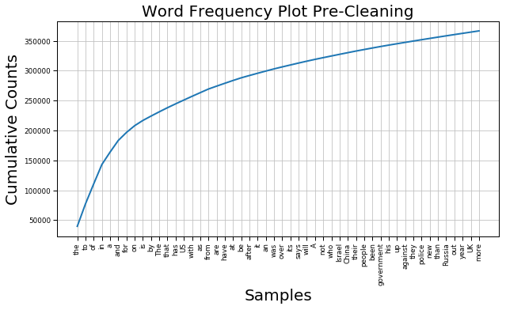
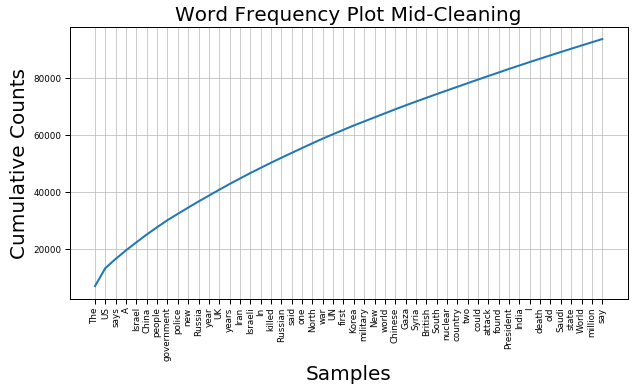
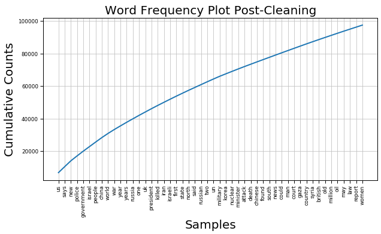

# Predicting Dow Jones Industrial Average Ups and Downs with Daily Top News Headlines
MSDS-696 - Data Science Practicum II - Final Project

## Indroduction
In this project, I have attempted to create a stock market performance prediction model using news headlines to assist with better investment performance. News reports can have a profound impact on stock market performance (Beers, 2019), but the problem is that there are so many news articles published every day that it’s nearly impossible for an individual person to be aware of everything going on in the news at any given moment, much less quantify the impact of each article on stock market performance. This project aims to address this issue by using natural language processing (NLP) and clustering on historic news headlines and stock performance from each day to better understand how the news can impact the stock market and, more importantly, assess how these news headlines can be used to predict whether the stock market will rise or fall that day and/or in the near future.  

## The Data
For this project, I used Kaggle datasets that include the top 25 daily news headlines from June 8, 2008 to July 1, 2016 and Dow Jones Industrial Average (DJIA) stock performance data during this same time period (Aaron7sun, 2016). This dataset contains nearly 2000 rows and 33 columns overall and is easily downloadable from Kaggle.

## Dependencies
Packages and libraries I made use of throughout this project include:
- `pandas`
- `numpy`
- `re`
- `seaborn`
- `matplotlib`
- `NLTK`
- `sklearn`
- `string`
- `statsmodels`
- `pylab`
- `operator`
- `wordcloud`
- `textblob`
- `datetime`
- `tqdm`
- `keras`

## Data Cleaning
For the data used in this model, the DJIA stock data was already very clean and did not contain any null values or anything similar that would require cleaning. The headlines data, however, did require some cleaning. Some of the headlines at some point had been saved as bitstrings, which resulted in these headlines beginning with `b'` and ending with `'`, so I addressed this with a simple regex match, replacing these artifacts with empty strings:
```
# compile regex since will be applying to multiple columns
bitstr_artifacts = re.compile(r"""^b'|^b"|"$|'$""")
# replace all instances of bitstring artifacts from headline columns in combined dataframe
for col in list(combined_df.columns)[2:]:
    combined_df[col] = combined_df[col].str.replace(bitstr_artifacts, '')
headlines_df['News'] = headlines_df['News'].str.replace(bitstr_artifacts, '')
```
Other notable cleaning steps for the headlines data included removing punctuation, replacing URL encoded values (such as `amp&`) with their semantic word equivalents, and also tokenizing the words from each headline:
```
for col in list(combined_df.columns)[2:]:
    # convert columns to str b/c Top23 apparently has byte like object
    combined_df[col] = combined_df[col].astype(str)
    # saw instance of & in S&P encoded as &amp; in last row of combined_df.tail(), replace with and to maintain semantic
    combined_df[col] = combined_df[col].str.replace("&amp;", "and")
    # replace hyphens with blank space. Don't want to combine hyphenations into single word as more meaninful as separate words
    combined_df[col] = combined_df[col].str.replace("-", " ")
    # replace all punctuation with blank space
    combined_df[col] = combined_df[col].str.replace(rf'[{string.punctuation}]', "")
    combined_df[col + '_tokenized'] = combined_df[col].apply(word_tokenize)
```
Finally, in order to make this headline data more useful for NLP and clustering, I had to remove all stop words from the headlines and convert them all to lowercase. Something that I decided to do here to make it a bit more interesting was investigate the effects of not perfomring these steps by looking at word frequency distributions before, during, and after cleaning the headlines. 

The first plot here is before I removed stop words and converted to lowercase. In this plot, stop words clearly win out as the most common words in all of the headlines making up all of the top 10 most frequent words and composing more than half of the top 50 most frequent words. Additionally, notice how both `a` and `A` are present since this is a case sensitive task:
```
all_headlines = " ".join(headlines_df['News'])
fdist = FreqDist(all_headlines.split())
plt.figure(figsize=(10, 5))
plt.title("Word Frequency Plot Pre-Cleaning")
fdist.plot(50, cumulative=True)
```
  

In this next plot I simply removed stop words and then remade the word frequency plot. Notice here that there are still some stop words since the method I used from the NLTK package to remove stop words expects all lowercase words, and despite removing all lower case stop words a stop word (`The`) is _still_ the most frequent word in the corpus of headlines:
```
en_stops = set(stopwords.words('english'))
all_headlines_no_stopwords = ""
for word in all_headlines.split():
    if word not in en_stops:
        all_headlines_no_stopwords += word + " "
fdist2 = FreqDist(all_headlines_no_stopwords.split())
plt.figure(figsize=(10, 5))
plt.title("Word Frequency Plot Mid-Cleaning")
fdist2.plot(50, cumulative=True)
```


Now in the last plot below I converted everything to lowercase and then removed all stop words. In this case all stop words were taken care of and I am now able to get a good idea of what the most frequent, meaningful, words are from the headlines, among the top 5 are `us`, `says`, `new`, `police`, and `government` which indicates to me that oftentimes headlines are telling us something about the United States, what someone or something said, about new things, and about institutions like police and government:
```
all_headlines_lower = all_headlines.lower()
all_headlines_lower_no_stopwords = ""
for word in all_headlines_lower.split():
    if word not in en_stops:
        all_headlines_lower_no_stopwords += word + " "
fdist3 = FreqDist(all_headlines_lower_no_stopwords.split())
plt.figure(figsize=(10, 5))
plt.title("Word Frequency Plot Post-Cleaning")
fdist3.plot(50, cumulative=True)
```


## Exploratory Data Analysis (EDA)

## Model Building

## Conclusions

### References
Aaron7sun. (2016, August 25). Daily News for Stock Market Prediction. Retrieved July 4, 2019, from https://www.kaggle.com/aaron7sun/stocknews
Beers, B. (2019, June 25). Why do stock prices change based on news reports? Retrieved July 4, 2019, from https://www.investopedia.com/ask/answers/155.asp
