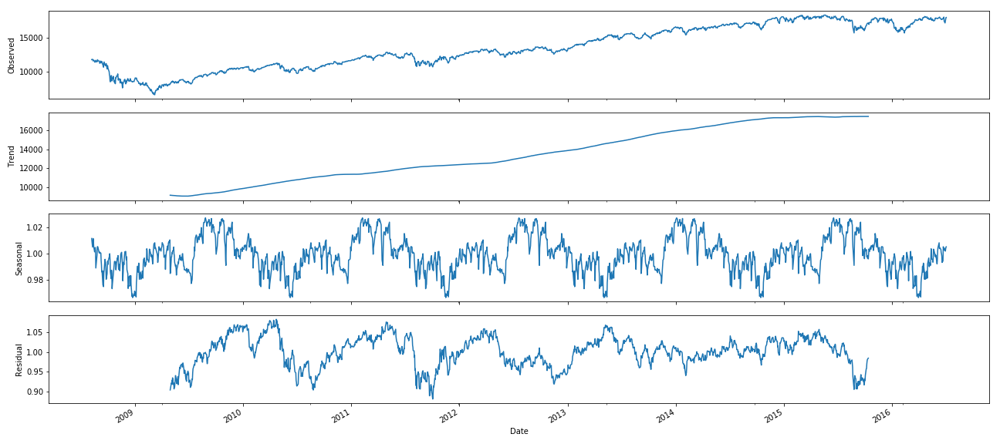

# Predicting Dow Jones Industrial Average Ups and Downs with Daily Top News Headlines
MSDS-696 - Data Science Practicum II - Final Project


## Indroduction
In this project, I have attempted to create a stock market performance prediction model using news headlines to assist with better investment performance. News reports can have a profound impact on stock market performance (Beers, 2019), but the problem is that there are so many news articles published every day that it’s nearly impossible for an individual person to be aware of everything going on in the news at any given moment, much less quantify the impact of each article on stock market performance. This project aims to address this issue by using natural language processing (NLP) and clustering on historic news headlines and stock performance from each day to better understand how the news can impact the stock market and, more importantly, assess how these news headlines can be used to predict whether the stock market will rise or fall that day and/or in the near future.

## The Data
For this project, I used Kaggle datasets that include the top 25 daily news headlines from June 8, 2008 to July 1, 2016 and Dow Jones Industrial Average (DJIA) stock performance data during this same time period (Aaron7sun, 2016). This dataset contains nearly 2000 rows and 33 columns overall and is easily downloadable from Kaggle.

## Dependencies
Packages and libraries I made use of throughout this project include:
- `pandas`
- `numpy`
- `re`
- `seaborn`
- `matplotlib`
- `NLTK`
- `sklearn`
- `string`
- `statsmodels`
- `pylab`
- `operator`
- `wordcloud`
- `textblob`
- `datetime`
- `tqdm`
- `keras`

## Data Cleaning
For the data used in this model, the DJIA stock data was already very clean and did not contain any null values or anything similar that would require cleaning. The headlines data, however, did require some cleaning. Some of the headlines at some point had been saved as bitstrings, which resulted in these headlines beginning with `b'` and ending with `'`, so I addressed this with a simple regex match, replacing these artifacts with empty strings:
```
# compile regex since will be applying to multiple columns
bitstr_artifacts = re.compile(r"""^b'|^b"|"$|'$""")
# replace all instances of bitstring artifacts from headline columns in combined dataframe
for col in list(combined_df.columns)[2:]:
    combined_df[col] = combined_df[col].str.replace(bitstr_artifacts, '')
headlines_df['News'] = headlines_df['News'].str.replace(bitstr_artifacts, '')
```
Other notable cleaning steps for the headlines data included removing punctuation, replacing URL encoded values (such as `amp&`) with their semantic word equivalents, and also tokenizing the words from each headline:
```
for col in list(combined_df.columns)[2:]:
    # convert columns to str b/c Top23 apparently has byte like object
    combined_df[col] = combined_df[col].astype(str)
    # saw instance of & in S&P encoded as &amp; in last row of combined_df.tail(), replace with and to maintain semantic
    combined_df[col] = combined_df[col].str.replace("&amp;", "and")
    # replace hyphens with blank space. Don't want to combine hyphenations into single word as more meaninful as separate words
    combined_df[col] = combined_df[col].str.replace("-", " ")
    # replace all punctuation with blank space
    combined_df[col] = combined_df[col].str.replace(rf'[{string.punctuation}]', "")
    combined_df[col + '_tokenized'] = combined_df[col].apply(word_tokenize)
```
Finally, in order to make this headline data more useful for NLP and clustering, I had to remove all stop words from the headlines and convert them all to lowercase. Something that I decided to do here to make it a bit more interesting was investigate the effects of not perfomring these steps by looking at word frequency distributions before, during, and after cleaning the headlines. 

The first plot here is before I removed stop words and converted to lowercase. In this plot, stop words clearly win out as the most common words in all of the headlines making up all of the top 10 most frequent words and composing more than half of the top 50 most frequent words. Additionally, notice how both `a` and `A` are present since this is a case sensitive task:
```
all_headlines = " ".join(headlines_df['News'])
fdist = FreqDist(all_headlines.split())
plt.figure(figsize=(10, 5))
plt.title("Word Frequency Plot Pre-Cleaning")
fdist.plot(50, cumulative=True)
```
  

In this next plot I simply removed stop words and then remade the word frequency plot. Notice here that there are still some stop words since the method I used from the NLTK package to remove stop words expects all lowercase words, and despite removing all lower case stop words a stop word (`The`) is _still_ the most frequent word in the corpus of headlines:
```
en_stops = set(stopwords.words('english'))
all_headlines_no_stopwords = ""
for word in all_headlines.split():
    if word not in en_stops:
        all_headlines_no_stopwords += word + " "
fdist2 = FreqDist(all_headlines_no_stopwords.split())
plt.figure(figsize=(10, 5))
plt.title("Word Frequency Plot Mid-Cleaning")
fdist2.plot(50, cumulative=True)
```


Now in the last plot below I converted everything to lowercase and then removed all stop words. In this case all stop words were taken care of and I am now able to get a good idea of what the most frequent, meaningful, words are from the headlines, among the top 5 are `us`, `says`, `new`, `police`, and `government` which indicates to me that oftentimes headlines are telling us something about the United States, what someone or something said, about new things, and about institutions like police and government:
```
all_headlines_lower = all_headlines.lower()
all_headlines_lower_no_stopwords = ""
for word in all_headlines_lower.split():
    if word not in en_stops:
        all_headlines_lower_no_stopwords += word + " "
fdist3 = FreqDist(all_headlines_lower_no_stopwords.split())
plt.figure(figsize=(10, 5))
plt.title("Word Frequency Plot Post-Cleaning")
fdist3.plot(50, cumulative=True)
```


And with that I was satisfied with my data cleaning, wrote the cleaned data out to CSVs, and moved on to EDA.

## Exploratory Data Analysis (EDA)
#### DJIA Data Exploration
The first thing I wanted to do in terms of exploring the data was related to the timeseries nature of stock market data. I wanted to see what this data looks like decomposed into the various components that are present in the data. To do this, I isolated the date and stock closing prices from the DJIA dataset, then applied the `seasonal_decompose` function to this. For the type of decompositional model, I decided to go with a multiplicative model because when it comes to stocks we care much more about the percentage difference from one time period to the next than we care about the absolute difference between these two numbers:
```
# grab just Date and closing value columns
temp = DJIA[['Date', 'Close']]
# need to set the date as the index for the seasonal_decompose function to work properly
temp = temp.set_index('Date')
# apply seasonal_decomposition function
decomp = sm.tsa.seasonal_decompose(temp, model='multiplicative', freq=365)
decomp.plot()
```


Clearly the general trend is that the stock market has been steadily rising over the 8 year period of this data, but what's really interesting to me is the seasonal aspect of this decomposistion. Looking at the seasonal trend, it appears that, typically, the stock market rises at the beginning of the year, takes a tumble in the middle of the year, then rises again, before finally taking one last tumble at the end of the year. This isn't strictly true for every year here, but for the most part the pattern holds, which is very useful to know in and of itself and might help to explain some of the recent turmoil in the economy; perhaps it's all just part of the pattern.

Next, I decided it would be interesting to engineer a `net_change` feature for the stocks dataset and explore this as well as see how this relates to the other variables in the dataset. I began by looking into the distribution of this new feature: 
```
DJIA['net_change'] = DJIA['Close'] - DJIA['Open']
DJIA.boxplot(column='net_change')
plt.title("DJIA Value Net Change Boxplot")
```


In this plot, I was interested to see that the wiskers are right around the 250 and -250 marks, which told me that while a net change of a couple hundred is a relatively rare and significant event being near the end of the wiskers, this isn't an outlier, which was interesting to me considering that 50% of net changes are between -60 and 75.

Next, I looked into how `net_change` might relate to other variables in the dataset as well as how these other variables relate to eachother using a scatter matrix:
```
pd.plotting.scatter_matrix(DJIA, figsize = (15, 15))
```


Unfortunately this didn't really add many insights as the near perfect correlations between all metrics other than Volume are practically perfectly straight lines. What this does show, however, is that a very high volume of trades occur on days when stocks have a low value and the amount of trading decreases as the value of the stock increases. This makes sense to me because of the age old addage to "Buy Low Sell High". This tells me one of two things: either people are really good at taking the buy low advice, but not quite so much with the sell high advice, or since people are so disinclined to buy high it doesn't really work out to sell high because no one is there to buy. In all actuality, I imagine these two things have a combinatorial impact on what we see here. Another interesting thing I saw with the volume data is that the correlation plots show a variable variance within them where the varaince of trade volume is much wider on days where stock values are lower while the variance window tightens as stock prices go up. This tells me that people are much less certain about what to do with their stocks when stock value is low whereas people seem to be more in sync when stock values are high. This suggests to me that people are fairly confident when the stock market is doing well that it will continue to do well but a large amount of uncertainty is introduced when the market begins doing poorly.

Another interesting things that this scatter matrix told me is more in relation to the distribution of the columns (seen in the histograms where column match with themselves) than the correlations themselves. All metrics aside from Volume have a very clear bimodal distribution along with a left skew while the Volume column has a unimodal distribution but a clear right skew. I'm not sure what this really means, but it's interesting to note.

As for the `net_change` column, the only thing I noticed here is that the variance of the net change widens as the trading volume goes up, which makes sense as trades are really what drive stock price changes. Additionally, the distribution of the net change is actually surprisingly normal to the naked eye. 

#### Headlines Data Exploration
During data cleaning, I did some preliminary EDA of the headlines by looking at the word frequency distributions of all the headlines overall, but something that I thought would be interesting is to isolate the `Top#` columns from the combined dataset and see if there are any noticable differences between the word frequency distributions of these various top headlines. To do this, I created a `ConditionalFreqDist` where I set the `Top#` as the condition in order to get frequency distributions by `Top#` headline:
```
# create empty conditional frequency distribution
cfdist = ConditionalFreqDist()
# loop through columbs of combined dataset
for col in list(combined.columns):
    # only want to work with cleaned columns
    if col.endswith("_cleaned"):
        # set the condition to the Top#
        condition = col.split("_")[0]
        # loop through each entry in the current column
        for item in combined[col]:
            # one item ended up empty after removing all digits and stop words, so skip this
            if str(item) == 'nan':
                continue
            # tokenize words in current item and loop through these
            for word in word_tokenize(item):
                # create word counds by condition in conditional frequency distribution
                cfdist[condition][word] += 1
```
Since I wanted to compare the frequency distributions of each `Top#` headlines, but I only really cared about the top words in each of these frequency distributions, I isolated the top 10 words from each of the frequency distributions and placed them into a set which will contain only the top 10 words from each column:
```
# initialize set
top_words = set()
# loop through the conditions
for key in list(cfdist.keys()):
    # initialize counter
    count = 0
    # since dictionarys are not sorted, sort them into list of tuples by value descending to ensure getting top counts
    cur_sorted = sorted(cfdist[key].items(), key = operator.itemgetter(1), reverse = True)
    # loop through the sorted list
    for item in cur_sorted:
        # add word to top words
        top_words.add(item[0])
        # increment counter
        count += 1
        # if reached count of 10 for current column break to next column
        if count == 10:
            break
```
With this in place, I then created conditional frequency distribution plots, isolating 5 `Top#` columns at a time in order to actually see distinctions between the columns:


From these plots, it appears that the `Top1` column shows an increased mention of `world` while this same column is showing a lower occurance rate of `russia` and `isreali` compared with other columns which, to me, indicates that oftentimes the most popular headlines relate more to global issues rather than individual country issues. Aside from this there weren't any differences that are worth noting.

After that I wanted to create some more interesting and visually appealing visualizations, so I decided to create a word cloud using all of the headlines to get a visual representation of what top headlines overall typically talk about:
```
# initialize temporary string
temp = ""
# loop through each headlines in the cleaned headlines
for line in headlines['News_cleaned']:
    # one headline ended up empty after removal of stop words and numbers, so just skip this
    if str(line) == "nan":
        continue
    # append lines to temporary string
    temp += line + " "
# generate word cloud with a max of 100 words using the temporary string
wc = WordCloud(max_words = 100, background_color = 'white').generate(temp)
plt.imshow(wc)
plt.axis('off')
plt.show()
```

Clearly many of the top words I mentioned when looking at word frequencies during cleaning are obvious here (US, say, new, police, and government). Something that I found odd, though, is the fact that government and police are actually smaller than other words like China, Israel, Russia, and Iran. I’m not too sure why this is, as I would’ve expected to see the top words from my initial word frequency distributions as the largest words here. 

At this point I was anxious to get on with building my models, so I moved on to the next phase of my project.

## Model Building

## Conclusions

### References
Aaron7sun. (2016, August 25). Daily News for Stock Market Prediction. Retrieved July 4, 2019, from https://www.kaggle.com/aaron7sun/stocknews
Beers, B. (2019, June 25). Why do stock prices change based on news reports? Retrieved July 4, 2019, from https://www.investopedia.com/ask/answers/155.asp
